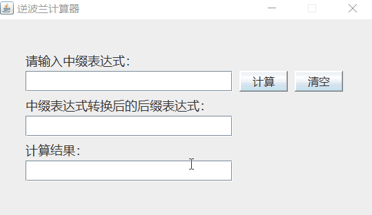

## 中缀表达式计算器——Java实现，有简单图形界面

#### 前言：

> 本篇文章撰写的初衷是为了记录本人的学习以及便于本人的再次学习，并为感兴趣的读者提供一个简单的思路参考。由于本人的能力有限，所以出现错误之处尽请见谅，如若能指出错误之处，笔者不胜感激。

#### 问题描述：

> 给定一个中缀表达式，将中缀表达式转换为后缀表达式（逆波兰表达式），并计算出逆波兰表达式的值。

#### 本逆波兰计算器限制：

> 1. 支持多位整数，不支持小数（对于支持小数的代码编写有兴趣的读者可以自行思考）
> 2. 支持操作符: '+', '-', '*', '/', '(', ')'

#### 逆波兰计算器算法：

> **一、中缀表达式转换为后缀表达式（逆波兰表达式）算法：**
>
> 1. 初始化两个栈，一个为存储操作符的操作符栈，一个为存储逆波兰表达式的逆波兰表达式栈。
> 2. 从左至右扫描中缀表达式。
> 3. 若读取到的字符为数字，则向后分析直到数字串的结束，并将数字串压入逆波兰表达式栈。
> 4. 若读取到的字符为'('，则直接将'('压入操作符栈，该操作符只有遇到右括号')'的时候出栈。
> 5. 若读取到的字符为')'，则将操作符栈中的栈顶操作符依次出栈并压入逆波兰表达式栈，直到遇到左括号'('为止，将操作符栈中栈顶的左括号'('出栈。
> 6. 若读取到的字符为运算符'+', '-', '*', '/':
> 	a. 如果操作符栈为空或栈顶元素为'('，则将读取到运算符直接压入操作符栈；
> 	b. 如果读取的运算符的优先级高于操作符栈栈顶运算符的优先级，则将读取的运算符直接压入操作符栈；
> 	c. 如果读取的运算符的优先级低于或等于操作符栈栈顶运算符的优先级，则将操作符栈栈顶运算符出栈并压入逆波兰表达式栈，将读取到的运算符压入操作符栈。（注意，此处优先级的比较是不断比较操作符栈栈顶运算符的优先级直到读取到的运算符的优先级高于操作符栈栈顶运算符的优先级或遇到'('或栈空）。
> 7. 重复2-6操作直到输入的中缀表达式扫描完毕，若操作符栈中仍然存在运算符，则将操作符栈中栈顶的运算符依次出栈并压入逆波兰表达式栈直到操作符栈为空。
> 8. 逆波兰表达式栈的出栈元素的逆序为中缀表达式转换后的后缀表达式（逆波兰表达式）。
>
> **二、后缀表达式（逆波兰表达式）求值算法：**
>
> 1. 初始化一个操作数栈。
> 2. 从左至右依次扫描后缀表达式的单元。
> 3. 如果扫描的单元是数字串，则将其转换为数字，并压入操作数栈，并扫描下一个单元。
> 4. 如果扫描的单元是运算符，则对操作数栈栈顶上的两个操作数执行该运算（取两次栈顶）,并将运算结果重新压入操作数栈。
> 6. 重复2-4操作，直到后缀表达式单元扫描完毕，最终操作数栈中栈顶元素即为计算结果值。

#### 测试举例：

> 输入中缀表达式：10+((20+30)*40)-50	(注意输入为英文字符)
>
> 求得后缀表达式：10 20 30 + 40 * + 50 -	(中间用空格隔开)
>
> 后缀表达式计算结果：1960

**中缀表达式转后缀表达式过程分析：**

扫描到的字符|操作符栈(栈底->栈顶)|逆波兰表达式栈（栈底->栈顶）|说明
:-:|:--:|:--:|:--:
1|||扫描到为数字，向后扫描直到数字串的结尾
0||10|扫描到为数字串结尾，数字串压入逆波兰表达式栈
+|+|10|操作符栈为空，运算符直接压入操作符栈
(|+,(|10|扫描到左括号'('，直接压入操作符栈
(|+,(,(|10|扫描到左括号'('，直接压入操作符栈
2|+,(,(|10|扫描到为数字，向后扫描直到数字串的结尾
0|+,(,(|10,20|扫描到为数字串结尾，数字串压入逆波兰表达式栈
+|+,(,(,+|10,20|操作符栈栈顶为左括号'('，运算符直接压入操作符栈
3|+,(,(,+|10,20|扫描到为数字，向后扫描直到数字串的结尾
0|+,(,(,+|10,20,30|扫描到为数字串结尾，数字串压入逆波兰表达式栈
)|+,(|10,20,30,+|扫描到右括号')',弹出操作符栈栈顶运算符并压入逆波兰表达式栈直至遇到左括号，左括号出栈
*|+,(,*|10,20,30,+|操作符栈栈顶为左括号'('，运算符直接压入操作符栈
4|+,(,*|10,20,30,+|扫描到为数字，向后扫描直到数字串的结尾
0|+,(,*|10,20,30,+,40|扫描到为数字串结尾，数字串压入逆波兰表达式栈
)|+|10,20,30,+,40,*|扫描到右括号')',弹出操作符栈栈顶运算符并压入逆波兰表达式栈直至遇到左括号，左括号出栈
-|-|10,20,30,+,40,*,+|扫描到的'-'运算符与运算符栈的栈顶运算符'+'优先级相同，故将栈顶运算符出栈并压入逆波兰表达式栈中，因为此时操作符栈已为空，故直接将扫描到的'-'压入操作符栈
5|-|10,20,30,+,40,*,+|扫描到为数字，向后扫描直到数字串的结尾
0|-|10,20,30,+,40,*,+,50|扫描到为数字串结尾，数字串压入逆波兰表达式栈
中缀表达式扫描完毕||10,20,30,+,40,*,+,50,-|将操作符栈中的运算符弹出并压入逆波兰表达式栈

**后缀表达式的计算分析过程：**
扫描到的单元|操作数栈(栈底->栈顶)|说明
:-:|:--:|:-:
10|10|扫描到的单元是数字串，则将其转换为数字，并压入操作数栈
20|10,20|扫描到的单元是数字串，则将其转换为数字，并压入操作数栈
30|10,20,30|扫描到的单元是数字串，则将其转换为数字，并压入操作数栈
+|10,50|扫描到的单元是运算符，则对操作数栈栈顶上的两个操作数执行该运算（取两次栈顶）20+30，并 将运算结果50重新压入操作数栈。
40|10,50,40|扫描到的单元是数字串，则将其转换为数字，并压入操作数栈
*|10,2000|扫描到的单元是运算符，则对操作数栈栈顶上的两个操作数执行该运算（取两次栈顶）50*40，并 将运算结果2000重新压入操作数栈。
+|2010|扫描到的单元是运算符，则对操作数栈栈顶上的两个操作数执行该运算（取两次栈顶）10+2000，并 将运算结果2010重新压入操作数栈。
50|2010,50|扫描到的单元是数字串，则将其转换为数字，并压入操作数栈
-|1960|扫描到的单元是运算符，则对操作数栈栈顶上的两个操作数执行该运算（取两次栈顶）2010-50，并 将运算结果1960重新压入操作数栈。
后缀表达式扫描完毕|1960|后缀表达式单元扫描完毕，最终操作数栈中栈顶元素即为计算结果值

#### 代码运行截图：

#### 运行环境：

> **jdk：** java version “1.8.0_241”
> **eclipse：**
> Eclipse IDE for Java Developers
> Version: 2019-12 (4.14.0)
